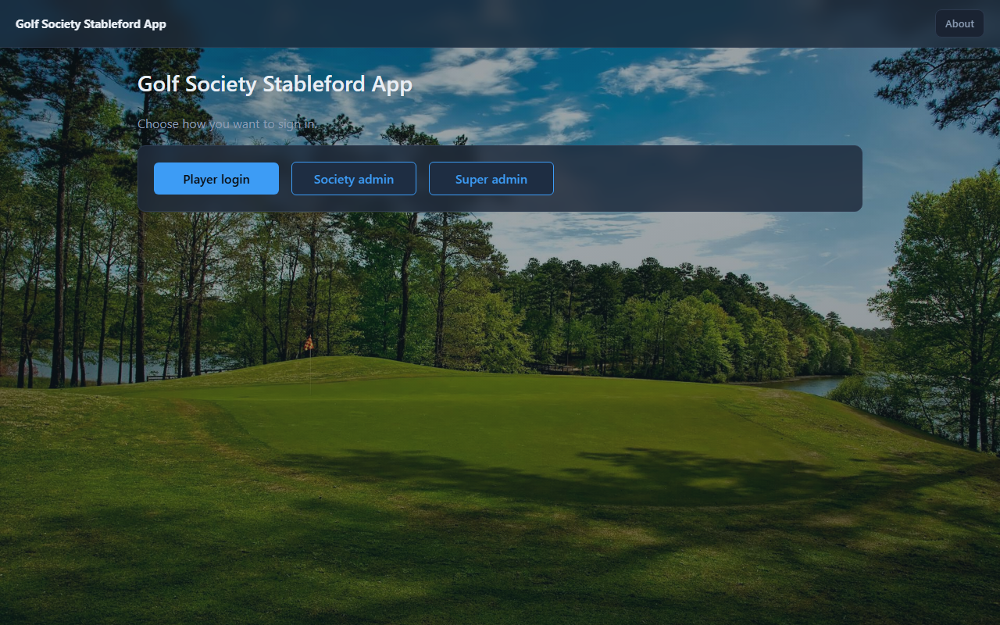
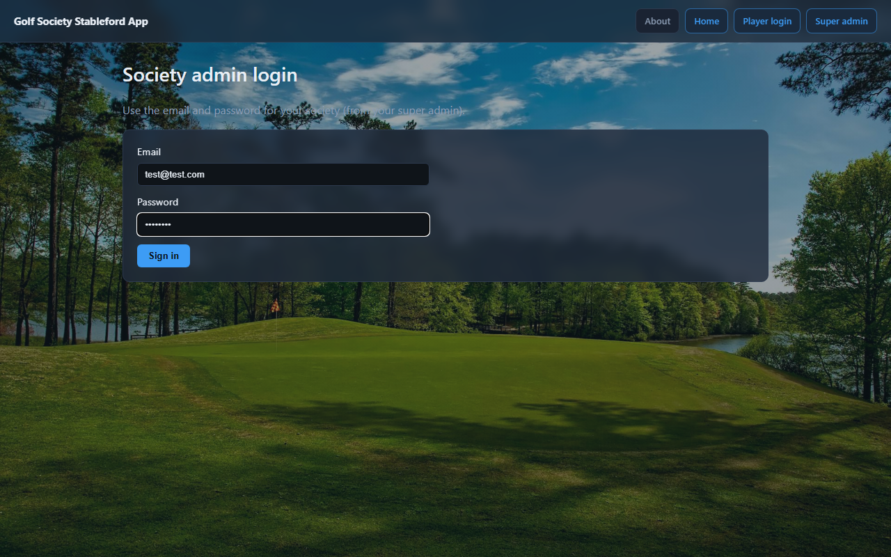
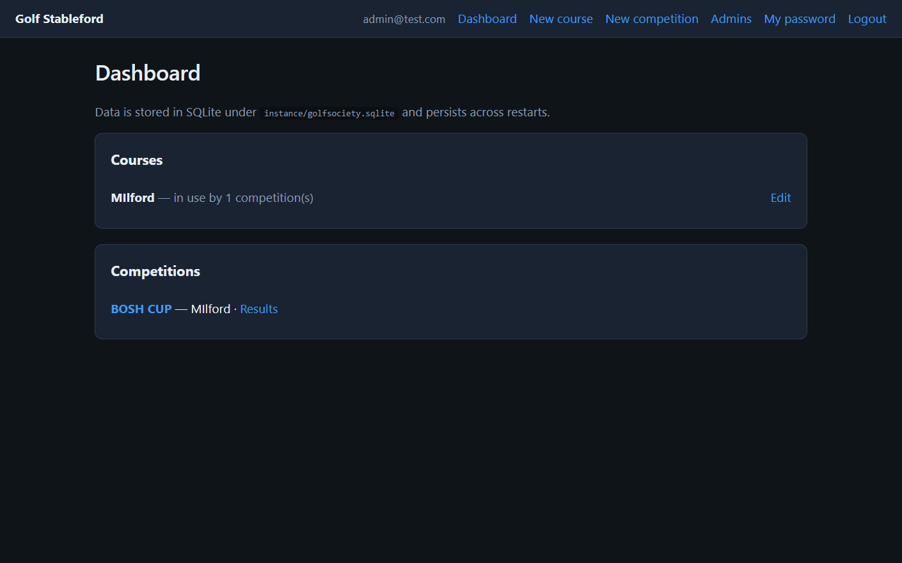
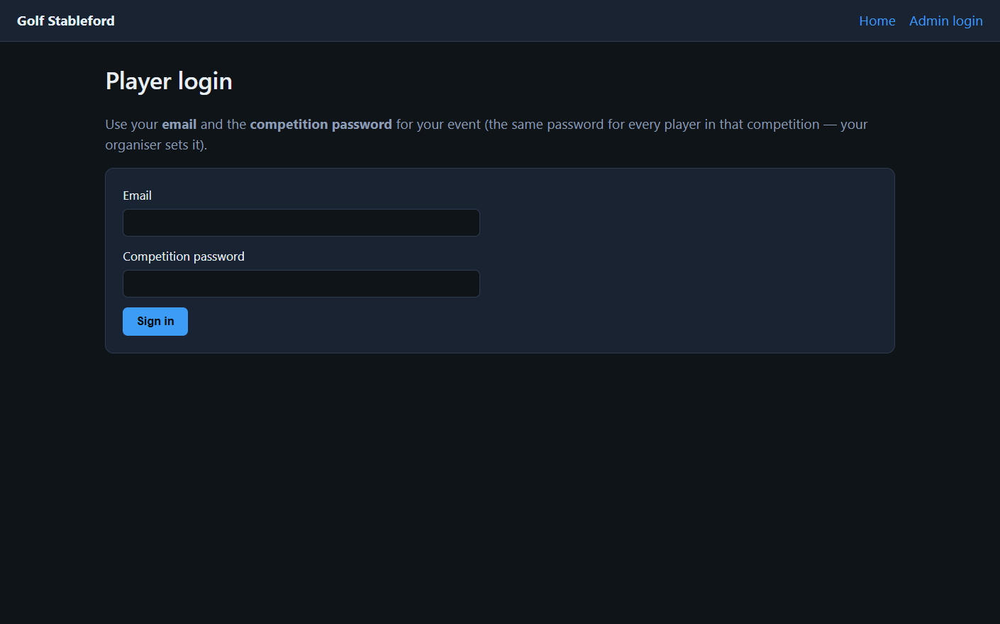

# Golf Society Stableford App

A small **Flask** app for running Stableford golf competitions with a three-tier model:

- **Super admins** create societies.
- **Society admins** manage courses, competitions, and society players.
- **Players** enter scores for competitions they are entered in.

Data is stored in **SQLite** at `instance/golfsociety.sqlite` and survives restarts.

---

## Screenshots

PNG files live under [`docs/screenshots/`](docs/screenshots/) (see [`docs/screenshots/README.md`](docs/screenshots/README.md) for filenames). Regenerate them with the app running: `pip install -r requirements-dev.txt`, `playwright install chromium`, then `python scripts/capture_readme_screenshots.py` (optional env: `BASE_URL`, `COMPETITION_ID`).

**Sample accounts used when capturing screenshots** (your data may differ):

| Role | URL | Email | Password |
|------|-----|-------|----------|
| Super admin | `/super-admin/login` | `superadmin@example.com` | `GolfSuper1!` |
| Society admin | `/admin/login` | `test@test.com` | `Test123!` |
| Player | `/login` | `toby@test.com` | Society shared player password or personal password |

| Home | Society admin login |
|------|---------------------|
|  |  |

| Society admin dashboard | Results |
|-------------------------|---------|
|  |  |

| Player login |
|--------------|
|  |

### Stroke index and handicap (diagram)

How stroke index interacts with playing handicap in code (matches the course editor help text):


### Full-page background (optional)

The UI uses a full-page background defined in [`static/style.css`](static/style.css). To show the golf-course photo, add:

`static/images/golf-course-bg.jpg`

If that file is missing, the gradient overlay still applies; only the photograph is absent.

---

## First login after deleting SQLite

If there are **no super admins**, the app creates one on startup:

| | |
|--|--|
| **Email** | `superadmin@example.com` |
| **Password** | `GolfSuper1!` |

Override with `BOOTSTRAP_SUPER_ADMIN_EMAIL` and `BOOTSTRAP_SUPER_ADMIN_PASSWORD` (must pass validation).

**Flow:** Super admin signs in and creates society (name + first society admin + shared player password) -> society admin signs in, shares the **player registration link** from Society players (or adds players manually), then manages courses and competitions.

**CLI:** `flask --app run create-society-admin email@example.com 'Pass1!word' SOCIETY_ID` adds another society admin to an existing society.

---

## How the logic works

### Roles

- **Super admin** (`/super-admin/login`): create societies and first society admin, lock/unlock societies, manage super admins, manage own password.
- **Society admin** (`/admin/login`): manage society players (create, self-registration link, CSV import, archive/restore, permanent delete, reset to shared password), shared player password, competitions, courses, results/PDF, and enter scores on behalf of players.
- **Players** (`/login`): sign in with **email + personal password** or **email + society shared player password**, then can submit scores for competitions they are entered in. New players can also **self-register** via a society-specific link (`/register/<token>`).

### Society players and competition entries

- Players are created at **society** level (`/admin/users`).
- **Player registration link:** each society has a unique token-based URL (e.g. `/register/NlF2GM5y5G6eFEZV2c1Yr74z…`) shown on the Society players page. Share this link so players can sign up themselves; the URL does not include the society name. Use **Generate new link** to rotate the token if a link is leaked. Registration is disabled while the society is locked.
- **Self-register:** players open the link, enter email, and optionally a personal password (blank uses the shared player password). They are signed in after a successful signup. Archived players in the same society can re-register with the same email to restore their account.
- **Shared player password:** set once per society. Players can sign in with email + shared password or a personal password.
- **Create player (admin):** email required; personal password optional — if left blank, the new player gets the shared player password (set the shared password first).
- **CSV import (society players):** bulk-create from `email` and optional `password` columns. Blank password uses the shared player password. Archived players in the CSV are restored.
- **Reset to shared password:** on an active player, resets their personal password to match the society shared password.
- **Archive / restore:** mark deleted hides a player from active lists and new competition add/import; restore brings them back.
- **Permanent delete:** archived players can be fully removed (competition entries and scores for that player are deleted).
- In competition setup, enter an **email** for an active society player not already in that event (suggestions from a datalist). Use **Create society player…** to open society players in a popup, add someone, then refresh the competition page.

### Competition management (society admin)

- **Competition handicap is event-specific** and stored per competition entry.
- **Handicap copy-forward:** when adding a player and leaving handicap blank, the app copies their handicap from their most recent previous competition in that society.
- **Lock competition:** while locked, players cannot change scores; roster changes, import, handicap edits, and removals are blocked. Society admins can still open **Enter scores** for any player in the event.
- **Enter scores (admin):** on the competition **Players** table, use **Enter scores** next to **Save HCP** to open that player’s scorecard and submit or update gross strokes hole by hole (works even when the competition is locked).
- **Remove player from competition:** removes that player only from the event and deletes their scores for that event.

### Stableford points (per hole)

Net strokes for a hole = **gross - handicap strokes on that hole**.

**Handicap strokes on a hole** (`app/stableford.py`):

1. `base = playing_handicap // 18` -> every hole receives `base`.
2. `remainder = playing_handicap % 18`.
3. If `remainder > 0`, each hole gets one extra on holes where **stroke index <= remainder**.

In this app, **SI 1 is hardest** and **SI 18 easiest**.

Points vs par:

| vs par | Points |
|--------|--------|
| 3+ under | 5 |
| 2 under | 4 |
| 1 under | 3 |
| Par | 2 |
| 1 over | 1 |
| 2+ over | 0 |

### Courses and stroke index (SI)

- Courses are shared across societies.
- Each course has exactly 18 holes.
- **New course:** enter name and postcode, then either fill the hole table manually or select a CSV with columns **`hole`**, **`par`**, and **`si`** (18 rows). The CSV fills the table in the browser; you can edit values before saving.
- Hole constraints:
  - Par: `3..6`
  - Stroke index: `1..18`, unique per course (**1 = hardest**, **18 = easiest**, matching a standard UK scorecard)
- Course deletion allowed only when unused by competitions.

### UI

- Password fields include a **Show password** / **Hide password** toggle so you can check what you typed before saving.

---

## Run locally

```bash
pip install -r requirements.txt
python run.py
```

Open `http://127.0.0.1:5000/`.

`run.py` controls local debug settings. For production, set a strong `SECRET_KEY`.

---

## Run with Docker

The repo includes `Dockerfile` and `docker-compose.yml`.

SQLite is stored at `/app/instance` in container and persisted via:

`./instance` (host) -> `/app/instance` (container)

### Start

```bash
mkdir instance
docker compose up --build -d
```

Open `http://localhost:5000/`.

### Rebuild with no cache

Use this when you need a completely fresh image build:

```bash
docker compose build --no-cache
docker compose up -d
```

Or in one command:

```bash
docker compose up --build --force-recreate -d
```

### Stop

```bash
docker compose down
```

Database remains at `instance/golfsociety.sqlite`.

### Environment variables with `docker-compose.override.yaml`

`docker-compose.yml` already maps:

- `SECRET_KEY`
- `BOOTSTRAP_SUPER_ADMIN_EMAIL`
- `BOOTSTRAP_SUPER_ADMIN_PASSWORD`

Preferred approach is keeping local env values in `docker-compose.override.yaml` (auto-loaded by Compose) rather than editing base compose file.

Example `docker-compose.override.yaml`:

```yaml
services:
  golfsociety:
    environment:
      SECRET_KEY: "replace-with-strong-secret"
      BOOTSTRAP_SUPER_ADMIN_EMAIL: "superadmin@example.com"
      BOOTSTRAP_SUPER_ADMIN_PASSWORD: "GolfSuper1!"
```

Then run:

```bash
docker compose up --build -d
```

PowerShell alternative (session-only env vars):

```powershell
$env:SECRET_KEY="replace-with-strong-secret"
$env:BOOTSTRAP_SUPER_ADMIN_EMAIL="superadmin@example.com"
$env:BOOTSTRAP_SUPER_ADMIN_PASSWORD="GolfSuper1!"
docker compose up --build -d
```

### Alternative without Compose

```bash
mkdir instance
docker build -t golfsociety .
docker run -d --name golfsociety-app -p 5000:5000 -v ${PWD}/instance:/app/instance golfsociety
```

---

## Project layout (high level)

| Path | Purpose |
|------|---------|
| `app/__init__.py` | App factory, session/login setup, SQLite migration hook, CLI |
| `app/models.py` | Super admins, societies, admins, users, courses, holes, competitions, scores |
| `app/stableford.py` | Handicap/stableford math |
| `app/scoring_helpers.py` | Leaderboards and scorecard helpers |
| `app/super_admin_routes.py` / `admin_routes.py` / `user_routes.py` / `main_routes.py` | HTTP routes |
| `app/csv_players.py` / `app/csv_helpers.py` | CSV parsing (competition roster and society players) |
| `app/player_helpers.py` | Shared player password assignment (admin create, CSV import, self-registration) |
| `app/db_migrate.py` | SQLite upgrades from earlier schema versions |
| `templates/` | Jinja templates |
| `static/style.css` | Theme/layout |
| `static/password-toggle.js` | Show/hide password on form fields |
| `docs/images/` | Diagrams |
| `docs/screenshots/` | Screenshot assets |
| `instance/golfsociety.sqlite` | SQLite database |

---

## CSV import

### Competition roster (`/admin/competitions/<id>`)

Expected columns (header row): **`email`** and **`handicap`** (aliases like `e_mail`, `playing_handicap`, `hcp` are accepted).

Import only adds/updates players **already in the society** and **not archived**. Archived players are skipped until restored.

### Society players (`/admin/users`)

Expected columns (header row): **`email`** and optional **`password`** (aliases like `e_mail`, `pwd`, `pass` are accepted).

- Blank **password** uses the society **shared player password** (must be set first).
- A non-blank password must meet the usual personal password rules (8+ chars, upper, lower, digit, symbol).
- Existing active players are skipped; archived players in the CSV are restored.

### New course (hole layout)

Optional CSV with columns **`hole`**, **`par`**, and **`si`** (aliases like `hole_number`, `stroke_index` are accepted). All 18 holes must be present. Name and postcode are still entered on the form.
